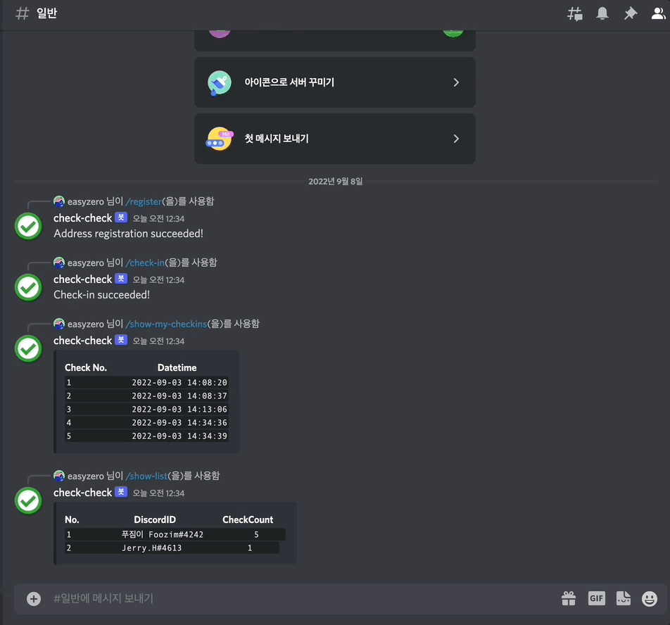

# Check-check

### **[Boomlabs] 1st-EVM 토이프로젝트 Discord Bot**

수료증 NFT(POAP) 민팅이 가능한 Web3 커뮤니티 출석체크 서비스

<div style="display: flex">
  
  
</div>

<br />

### Bot Command
**User**
- `/register ` - 사용자 지갑주소 등록
- `/check-in` - 사용자 출석체크 (지갑주소 등록 필수)
- `/show-my-checkins` - 사용자 자신의 출석 현황 확인

**Admin(Discord server's owner)**
- `/show-list` - 전체 출석 현황 확인
- `/issue-certificate` - 수료증 NFT 민팅

### Stack
     

### Project Repository 
[[Team6] Boom-Check](https://github.com/boom-check)

### Project Review
[Notion - EVM Team6 발표자료 (9/3)](https://easy0.notion.site/EVM-6-9-3-146c6541daa344d2869908796bff0e31)


### View Contract
[EtherScan (Goerli Test Network)](https://goerli.etherscan.io/address/0xa0813403bb3046bb40cab65a5813e7160f101c57)

<br />

## Install  

<br />

1. 패키지 설치
   ```sh
   npm install
   ```
   <br />
2. 환경 설정
   ```sh
   cp config.json.example config.json
   vi config.json
   ```
   <br />
3. 커맨드 등록
   ```sh
   npm run deploy-commands
   ```
   <br />
4. 실행
   ```sh
   npm start
   ```

<br />

